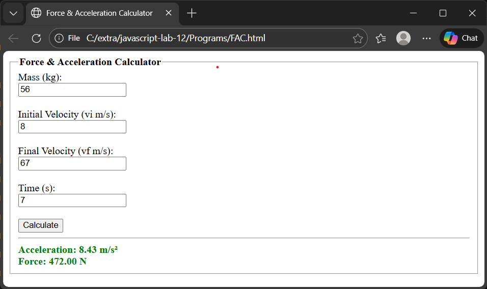

# DOM & Event Handeling

## What is DOM?

The **DOM** stands for **Document Object Model**. It is a programming interface that allows JavaScript to access, modify, and manipulate HTML documents. 

The **Document Object Model (DOM)** connects web pages to scripts or programming languages by representing the structure of a document—such as the HTML representing a web page—in memory.

- When a web page loads, the browser converts HTML into a tree-like structure.

- Each HTML element becomes an object (node).

- JavaScript uses the DOM to interact with these objects.

```html
<!DOCTYPE html>
<html>
    <head>
        <title>DOM Tree Example</title>
    </head>
    <body>
        <h1>This is a Heading</h1>
        <p>This is a paragraph</p>
    </body>
</html>
```

```
Document
 └── html        → <html>
     ├── head    → <head>
     └── body    → <body>
         ├── h1  → <h1>
         └── p   → <p>
```


### document Properties & DOM Selection Methods

**document Properties:**

|  Property       | Description              | Returns             |
|-----------------|--------------------------|---------------------|
| `document`      | Root object of the DOM   | **Document object** |
| `document.body` | Selects `<body>` element | **HTMLBodyElement** |
| `document.head` | Selects `<head>` element | **HTMLHeadElement** |

**document DOM Selection Methods:**

| Method                              | Description                  | Returns                   | Example                                   |
|-------------------------------------|------------------------------|---------------------------|-------------------------------------------|
| `document.getElementById()`         | Selects element by ID        | **HTMLElement** or `null` | `document.getElementById("title")`        |
| `document.getElementsByClassName()` | Selects elements by class    | **HTMLCollection**        | `document.getElementsByClassName("item")` |
| `document.getElementsByTagName()`   | Selects elements by tag name | **HTMLCollection**        | `document.getElementsByTagName("p")`      |

**Important DOM Element Properties:**

| Property      | What it Does                         | Used For                      | Example                         |
|---------------|--------------------------------------|-------------------------------|---------------------------------|
| `innerHTML`   | Gets or sets HTML inside an element  | Insert or change HTML content | `el.innerHTML = "<b>Hello</b>"` |
| `innerText`   | Gets or sets visible text            | Change text shown to user     | `el.innerText = "Hello"`        |
| `style`       | Accesses inline CSS styles           | Change element appearance     | `el.style.color = "red"`        |
| `value`       | Gets or sets input value             | Forms & user input            | `input.value = "123"`           |
| `href`        | Gets or sets link URL                | Anchor (`<a>`) elements       | `link.href = "https://site.com"`|
| `src`         | Gets or sets source file             | Images, scripts               | `img.src = "img.jpg"`           |
| `checked`     | Gets or sets checked state           | Checkbox / radio              | `cb.checked = true`             |
| `disabled`    | Enables or disables element          | Buttons, inputs               | `btn.disabled = true`           |

#### HTMLElement 

In JavaScript, **``HTMLElement``** is a built-in object (class) that represents any HTML element in the ``DOM (Document Object Model)``.

- Every element in the HTML page is an instance of ``HTMLElement``.
- It gives you properties and methods to manipulate that element in JavaScript.

```html
<html>

<head>
  <title>JS Element</title>
</head>

<body>

    <h1 id="title">Hello World!</h1>

    <script>
    // Get element by ID
    let el = document.getElementById("title");
    
    // Change its text immediately
    el.innerText = "Welcome to JavaScript!";
    </script>

</body>
</html>

```

#### HTMLCollection

**``HTMLCollection``** is a live collection of HTML elements in the ``DOM``. 

- It is array-like, meaning you can access elements by index or name, but it’s not a true array.

- Live collection → automatically updates if the DOM changes.

```html
<html>

<head>
  <title>HTMLCollection Example</title>
</head>

<body>

  <p class="odd-even-pattern">Paragraph 1</p>
  <p class="odd-even-pattern">Paragraph 2</p>
  <p class="odd-even-pattern">Paragraph 3</p>
  <p class="odd-even-pattern">Paragraph 4</p>

  <script>
    // Get all <p> elements with class "color"
    let paragraphs = document.getElementsByClassName("odd-even-pattern");

    // Loop through HTMLCollection
    for (let i = 0; i < paragraphs.length; i++) {
      if ((i + 1) % 2 === 1) {
        // Odd numbered paragraph (1, 3, ...)
        paragraphs[i].style.color = "red";
      } else {
        // Even numbered paragraph (2, 4, ...)
        paragraphs[i].style.color = "green";
      }
    }
  </script>

</body>

</html>
```

## Event Handeling

Event handling allows JavaScript to respond to user actions.

```html
<html>

<head>
  <title>Event Handling Example</title>
</head>

<body>
    <button onclick="showMessage()">Click Me</button>

    <script>
        function showMessage() 
        {
            alert("Button clicked!");
        }
    </script>

</body>
</html>
```

### Events in JavaScript

#### Mouse Events

Mouse events are triggered by user interactions with a mouse.

| Event         | Description                                                  | 
| ------------- | ------------------------------------------------------------ | 
| `click`       | Occurs when the user **clicks** an element (press + release) |
| `dblclick`    | Occurs when the user **double-clicks** an element            | 
| `mousedown`   | Occurs when the mouse **button is pressed** down             |
| `mouseup`     | Occurs when the mouse **button is released**                 |
| `mousemove`   | Occurs when the mouse **moves** over an element              | 
| `mouseover`   | Occurs when the mouse **enters** an element                  |
| `mouseout`    | Occurs when the mouse **leaves** an element                  | 
| `mouseenter`  | Similar to `mouseover` but **does not bubble**               |
| `mouseleave`  | Similar to `mouseout` but **does not bubble**                |
| `contextmenu` | Occurs when the **right mouse button** is clicked            |

```html
<html>

<head>
  <title>Mouse Event</title>
</head>

<body>
  <h2>Different JavaScript Events Example</h2>
  <button id="btn1" onclick="changeRed()">Click → Red</button>
  <button id="btn2" ondblclick="changeBlue()">Double Click → Blue</button>
  <button id="btn3" onmouseover="changeGreen()">Mouse Over → Green</button>
  <button id="btn4" onmouseout="changePurple()">Mouse Out → Purple</button>
  <button id="btn5" oncontextmenu="changeOrange(event)">Right Click → Orange</button>

  <script>
    function changeRed() {
      document.body.style.background = "red";
    }

    function changeBlue() {
      document.body.style.background = "blue";
    }

    function changeGreen() {
      document.body.style.background = "green";
    }

    function changePurple() {
      document.body.style.background = "purple";
    }

    function changeOrange(event) {
      event.preventDefault();
      document.body.style.background = "orange";
    }
  </script>
</body>

</html>
```

####  Key Events

Key events are triggered by keyboard actions.

| Event      | Description                                                | Example Use                        |
| ---------- | ---------------------------------------------------------- | ---------------------------------- |
| `keydown`  | Occurs when a **key is pressed down**                      | Detecting arrow key press          |
| `keypress` | Occurs when a **key that produces a character** is pressed | Typing letters/numbers             |
| `keyup`    | Occurs when a **key is released**                          | Validating input after key release |

##### Example:

```html
<html>

<head>
    <title>Keyboard Events</title>
</head>

<body>
    <h2>Keyboard Event Demo</h2>
    <input type="text" placeholder="Type something..." onkeydown="showKeyDown(event)"
        onkeypress="showKeyPress(event)" onkeyup="showKeyUp(event)">
    <p id="output">Key info will appear here</p>
    
    <script>
        let output = document.getElementById("output");

        function showKeyDown(event) {
            output.innerText = "Key Down: " + event.key;
        }

        function showKeyPress(event) {
            output.innerText = "Key Press: " + event.key;
        }

        function showKeyUp(event) {
            output.innerText = "Key Up: " + event.key;
        }
    </script>
</body>

</html>
```

## Tasks:

### Simple Interest Calculator

You are given an HTML and JavaScript program that calculates **Simple Interest (SI)**.

#### Input Fields
- Principal (P)  
- Rate (R %)  
- Time (T in years)  

#### Functionality
- Calculates SI using the formula:  
    ```
    SI = p * t * r
    ```
- Displays the result in the `<div>` with id `result`.  
- Shows **separate error messages** for each field if the input is invalid:
  - Empty input  
  - Principal ≤ 0  
  - Rate ≤ 0 or > 100  
  - Time ≤ 0  

#### Output


```html
<html>

<head>
    <title>SI Calculator</title>
</head>

<body>

    <fieldset>
        <legend><strong>Simple Interest Calculator</strong></legend>
        <label>Principal (P)</label><br>
        <input type="number" id="p" placeholder="Enter Principal" min="0"><br>
        <span style="color: red; font-style: italic; font-weight: bold;" id="error-p" class="error"></span><br>
        <label>Rate (R %)</label><br>
        <input type="number" id="r" placeholder="Enter Rate" min="0" max="100"><br>
        <span style="color: red; font-style: italic; font-weight: bold;" id="error-r" class="error"></span><br>
        <label>Time (T)</label><br>
        <input type="number" id="t" placeholder="Enter Time" min="0"><br>
        <span style="color: red; font-style: italic; font-weight: bold;" id="error-t" class="error"></span><br>
        <button onclick="calculateSI()">Calculate</button><br>
        <hr>
        <div style="color: green; font-weight: bolder;" id="result"></div>
    </fieldset>

    <script>
        function calculateSI() {
            let p = document.getElementById("p").value;
            let r = document.getElementById("r").value;
            let t = document.getElementById("t").value;
            let errorP = document.getElementById("error-p");
            let errorR = document.getElementById("error-r");
            let errorT = document.getElementById("error-t");
            let result = document.getElementById("result");
            // Clear previous errors and result
            errorP.innerText = "";
            errorR.innerText = "";
            errorT.innerText = "";
            result.innerText = "";
            let valid = true;
            // Validate Principal
            if (p === "") { errorP.innerText = "Enter principal!"; valid = false; }
            else if (p <= 0) { errorP.innerText = "Principal must be > 0"; valid = false; }
            // Validate Rate
            if (r === "") { errorR.innerText = "Enter rate!"; valid = false; }
            else if (r <= 0) { errorR.innerText = "Rate must be > 0%"; valid = false; }
            else if (r > 100) { errorR.innerText = "Rate cannot exceed 100%"; valid = false; }
            // Validate Time
            if (t === "") { errorT.innerText = "Enter time!"; valid = false; }
            else if (t <= 0) { errorT.innerText = "Time must be > 0"; valid = false; }
            if (valid == true) {
                let si = (p * r * t) / 100;
                result.innerText = `Simple Interest: Rs. ${si.toFixed(2)}`;
            }
        }
    </script>

</body>

</html>
```

### Force & Acceleration Calculator

You are given an HTML and JavaScript program that calculates **Acceleration (a)** and **Force (F)** acting on an object.

#### Input Fields
- Mass (m in kilograms)  
- Initial Velocity (vi in m/s)  
- Final Velocity (vf in m/s)  
- Time (t in seconds)  

#### Functionality
- Calculates **Acceleration** using the formula:  
    ```
    a = (vf - vi) / t
    ```
- Calculates **Force** using the formula:  
    ```div
    F = m * a
    ```
- Displays the results in the `<div>` with id `result`.  
- Shows **separate error messages** for each field if the input is invalid:
  - Empty input  
  - Mass ≤ 0  
  - Time ≤ 0  
  - Initial or final velocity negative (if applicable)  

#### Output


> Do Yourself